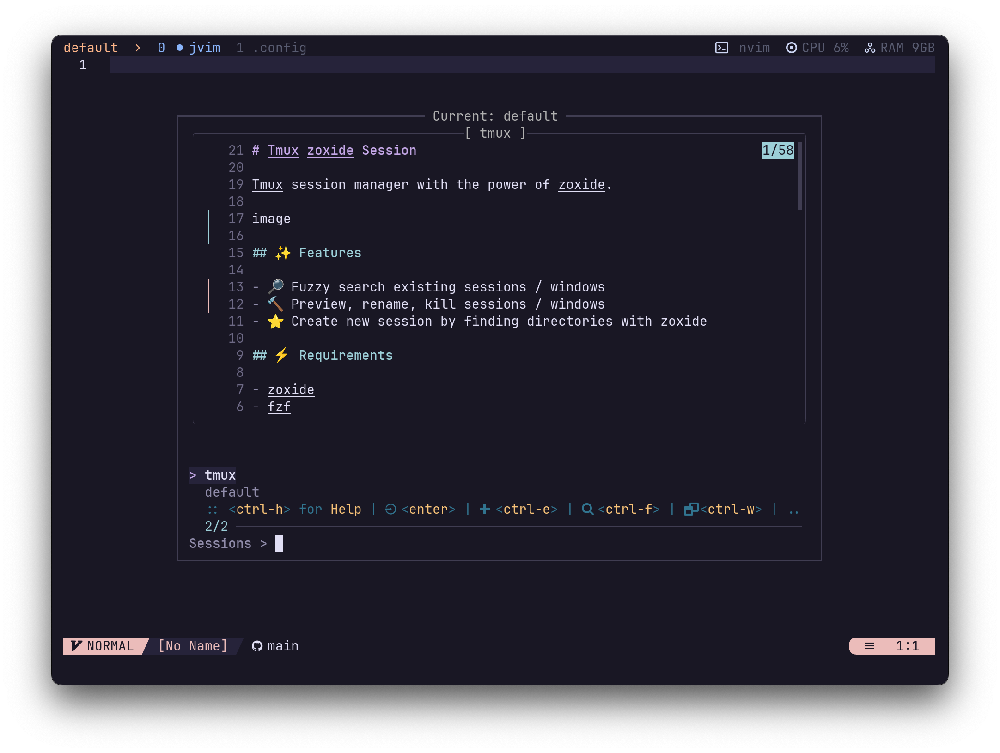

# Tmux zoxide Session

Tmux session manager with the power of zoxide.



## ✨ Features

- 🔎 Fuzzy search existing sessions / windows
- 🔨 Preview, rename, kill sessions / windows
- ⭐ Create new session by finding directories with zoxide

## ⚡️ Requirements

- [zoxide](https://github.com/ajeetdsouza/zoxide)
- [fzf](https://github.com/junegunn/fzf)
- [tpm](https://github.com/tmux-plugins/tpm) (optional)

## 📦 Installation

### Install with TPM

- Add this plugin to `.tmux.conf` and run `<prefix> Ctrl-I` for TPM to install.

  ```bash
  set -g @plugin 'jeffnguyen695/tmux-zoxide-session'
  ```

### Install manually

1. Clone the repository

    ```bash
    git clone https://github.com/jeffnguyen695/tmux-zoxide-session ~/clone/path
    ```

2. Add this line to the bottom of `.tmux.conf`

    ```bash
    run-shell ~/clone/path/zoxide-session.tmux
    ```

3. Reload tmux

    ```bash
    tmux source-file ~/.tmux.conf
    ```

## 🚀 Usage


Inside tmux

- `<prefix> S` to launch the popup session manager
- `Ctrl-h` to show help
- Start typing to fuzzy search sessions
- `Ctrl-w` to switch to window view
- `Enter` to go to selected session / window
- `Ctrl-x` to kill selected session / window
- `Ctrl-r` to rename selected session / window
- When no existing session is found:
  - `Enter` to create a new session with best match directory from zoxide
  - `Ctrl-e` to create a new session with the query as its name
- `Ctrl-f` to find directories with zoxide, hitting `Enter` will create a new session with that directory.
- `Escape` to go back
- `Ctrl-p` / `Ctrl-n` to select up / down
- `Ctrl-u` / `Ctrl-d` to scroll preview up / down

## ⚙️ Configuration

```bash
# Key bindings

set -g @tzs-key-accept 'enter'
set -g @tzs-key-new 'ctrl-e'
set -g @tzs-key-kill 'ctrl-x'
set -g @tzs-key-rename 'ctrl-r'
set -g @tzs-key-find 'ctrl-f'
set -g @tzs-key-window 'ctrl-w'
set -g @tzs-key-select-up 'ctrl-p'
set -g @tzs-key-select-down 'ctrl-n'
set -g @tzs-key-preview-up 'ctrl-u'
set -g @tzs-key-preview-down 'ctrl-d'
set -g @tzs-key-help 'ctrl-h'
set -g @tzs-key-quit 'esc'
set -g @tzs-key-launch 'S'

# UI
set -g @tzs-preview-location 'top'
set -g @tzs-preview-ratio '65%'
set -g @tzs-window-height '75%'
set -g @tzs-window-width '75%'

set -g @tzs-key-accept-icon '󰿄'
set -g @tzs-key-new-icon ''
set -g @tzs-key-kill-icon '󱂧'
set -g @tzs-key-rename-icon '󰑕'
set -g @tzs-key-find-icon ''
set -g @tzs-key-window-icon ''
set -g @tzs-key-select-up-icon ''
set -g @tzs-key-select-up-icon ''
set -g @tzs-key-preview-up-icon ''
set -g @tzs-key-preview-down-icon ''
set -g @tzs-key-help-icon ''
set -g @tzs-key-quit-icon ''
```

## Reference

- Heavily inspired by [tmux-sessionx](https://github.com/omerxx/tmux-sessionx)
- Also [tmux-sessionizer](https://github.com/ThePrimeagen/.dotfiles/blob/master/bin/.local/scripts/tmux-sessionizer)
